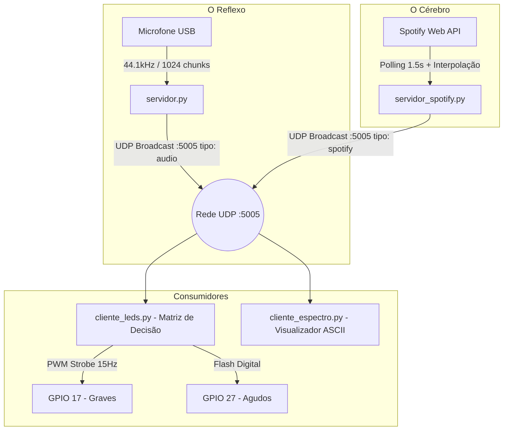

# 📝 CONTEXTO DO PROJETO: Audio to Light (Raspberry Pi Híbrido)

Este documento foi criado para fornecer o **contexto completo do projeto**, a arquitetura de software, a pinagem de hardware, os métodos de acesso remoto à Raspberry Pi e os detalhes técnicos para que qualquer desenvolvedor ou agente de IA possa dar continuidade imediatamente.

---

## 📌 1. Visão Geral e Objetivo

Sistema de **Luzes Rítmicas Inteligentes (Audio-to-Light)** rodando em uma **Raspberry Pi 3**. O sistema analisa o som ambiente em tempo real e controla LEDs físicos divididos por faixas de frequência e energia musical.

### O Conceito do Sistema Híbrido:
* **O Microfone é o "Reflexo"** (Sincronia em milissegundos): Captura o áudio analógico do ambiente via microfone USB, aplica Transformada Rápida de Fourier (FFT) e detecta transientes e batidas (onsets) em tempo real sem latência perceptível.
* **A API do Spotify é o "Cérebro"** (Contexto musical): Monitora a música que o usuário está ouvindo via `spotipy`, identifica gênero, nível de energia, danceabilidade, seções e volume (loudness).
* **Os LEDs executam a "Matriz de Decisão"**: Ajustam dinamicamente os efeitos visuais (ex: estrobo agressivo vs. fade suave) dependendo do contexto musical do Spotify e do reflexo do microfone.

---

## 🖥️ 2. Hardware e Pinagem

* **Placa Principal:** Raspberry Pi 3 Model B (Raspbian Linux / Python 3.11).
* **Entrada de Áudio:** Placa de Som / Microfone USB dedicado (a RPi não possui ADC analógico na porta P2/GPIO).
* **Saídas GPIO (Numeração BCM):**
  * **GPIO 17 (Pino Físico 11):** Luzes de **Graves / Kick / Sub-Bass**. Controlado via **PWM por hardware a 15Hz** para efeito *Strobe*.
  * **GPIO 27 (Pino Físico 13):** Luzes de **Agudos / Pratos / Hi-Hats**. Controlado via acionamento digital rápido (*Flash*).

---

## 🔑 3. Como Acessar a Raspberry Pi (Rede e Comandos)

* **Endereço IP:** `192.168.31.3`
* **Usuário:** `gabs`
* **Diretório do Projeto na RPi:** `/home/gabs/rasp_audio`
* **Autenticação SSH:** Chave SSH já configurada (não pede senha ao conectar via WSL/Linux).

### Comandos Essenciais via Terminal (WSL / Bash):
```bash
# 1. Acesso SSH direto
wsl bash -c "ssh gabs@192.168.31.3"

# 2. Executar comando remoto
wsl bash -c "ssh gabs@192.168.31.3 'cd ~/rasp_audio && ls -la'"

# 3. Enviar arquivos modificados para a Raspberry Pi (Deploy)
wsl bash -c "scp *.py gabs@192.168.31.3:~/rasp_audio/"

# 4. Baixar arquivos da Raspberry Pi para o repositório local
wsl bash -c "scp 'gabs@192.168.31.3:~/rasp_audio/*.py' ."
```

---

## 🏗️ 4. Arquitetura de Software (Produtor/Consumidor UDP)

Para evitar conflitos com o driver de áudio do Linux (ALSA), que bloqueia o microfone para uso exclusivo de um único processo, o sistema utiliza **comunicação desacoplada via UDP Broadcast na porta 5005**.



---

## 📂 5. Descrição dos Scripts

| Arquivo | Função |
| :--- | :--- |
| `servidor.py` | **Produtor de Áudio:** Captura PyAudio, calcula FFT em Hz reais (`sub_graves`, `graves`, `medios`, `agudos`) e aplica Onset Detection com Baseline Assimétrica para detectar batidas contínuas sem sufocar sequências. Transmite `tipo: audio`. |
| `servidor_spotify.py` | **Produtor de Contexto:** Consulta o Spotify via `spotipy`, infere o perfil musical por gênero do artista (`sp.artist`), calcula mapa de seções da música e transmite metadados `tipo: spotify` a ~10Hz com tempo interpolado. |
| `cliente_leds.py` | **Consumidor de Hardware:** Escuta a porta UDP 5005, cruza o reflexo com o contexto do Spotify e aciona a Matriz de Decisão nos pinos GPIO 17 e 27. Possui fallback automático se o Spotify estiver desligado. |
| `cliente_espectro.py` | **Calibrador e Monitor Visual:** Exibe no terminal as barrinhas ASCII do espectro, marcadores de batida (`💥 [PICO!]` / `⚡ [ATIVO]`) e metadados da música atual. |
| `.env` | Armazena `SPOTIPY_CLIENT_ID`, `SPOTIPY_CLIENT_SECRET`, `SPOTIPY_REDIRECT_URI` e `PORTA_UDP`. *(Protegido no `.gitignore`)*. |
| `.env.example` | Modelo público para criação do arquivo `.env`. |
| `requirements.txt` | Lista de dependências Python (`spotipy`, `python-dotenv`, `numpy`, `pyaudio`). |

---

## 🎛️ 6. Matriz de Decisão dos Efeitos dos LEDs

| Modo Spotify | Condição Musical | Comportamento Graves (GPIO 17) | Comportamento Agudos (GPIO 27) |
| :--- | :--- | :--- | :--- |
| **Alta Energia** | `energy >= 0.70` ou Refrão/Drop | **Strobe Máximo (PWM 15Hz @ 50%)** pulsando no ritmo exato do bumbo | **Flash Rápido e Sensível** em todo prato |
| **Média Energia** | `0.40 <= energy < 0.70` (Versos/Pop) | **Strobe Moderado** no ritmo das batidas | Flash padrão nos pratos |
| **Suave / Calma** | `energy < 0.40` (Lofi, Acústica, Intro) | **Sem Strobe Agressivo**; Brilho suave e pulsante proporcional | Flash atenuado (apenas pratos fortes) |
| **Standby** | Spotify Pausado | Desligado / Repouso | Desligado / Repouso |
| **Fallback** | Sem conexão Spotify | Resposta rítmica adaptativa por microfone | Resposta rítmica adaptativa por microfone |

---

## 🧮 7. Regras Matemáticas e Algoritmos

1. **Conversão de Hertz para Bins FFT:**
   $$\text{bin} = \text{int}\left(\frac{\text{freq\_hz} \times \text{CHUNK}}{\text{RATE}}\right)$$
   *(CHUNK = 1024, RATE = 44100Hz)*
2. **Baseline Assimétrica (Anti-Sufocamento de Batidas Rápidas):**
   - Se $\text{valor} > \text{baseline}$: $\text{baseline} = 0.008 \times \text{valor} + 0.992 \times \text{baseline}$ *(sobe muito devagar para não engolir batidas subsequentes)*.
   - Se $\text{valor} < \text{baseline}$: $\text{baseline} = 0.08 \times \text{valor} + 0.92 \times \text{baseline}$ *(desce rápido em pausas)*.
3. **Limiar e Envelope de Pico:**
   $$\text{Limiar} = \text{baseline} \times \text{sensibilidade}$$
   $$\text{Ativo} = (\text{valor} \ge \text{Limiar})$$

---

## 🚀 8. Como Executar na Raspberry Pi

Conecte via SSH e navegue até a pasta:
```bash
ssh gabs@192.168.31.3
cd ~/rasp_audio

# Terminal 1: Captura e FFT do Microfone
python3 servidor.py

# Terminal 2: Cérebro Contextual do Spotify
python3 servidor_spotify.py

# Terminal 3: Controle Físico dos LEDs
python3 cliente_leds.py

# Terminal 4 (Opcional): Monitor Visual no Terminal
python3 cliente_espectro.py
```

---

## ⚠️ 9. Dicas Importantes para Próximas IAs / Desenvolvedores

1. **Sempre codifique os arquivos em UTF-8:** O Linux/Python na Raspberry Pi rejeita caracteres ISO-8859-1 sem declaração de encoding.
2. **Sempre teste na Raspberry Pi:** Como o ambiente envolve hardware físico (GPIO e Microfone USB), execute testes remotamente via `ssh gabs@192.168.31.3 'cd ~/rasp_audio && ...'`.
3. **Bibliotecas do Sistema:** Na Raspberry Pi com Debian Bookworm (Python 3.11), use `pip3 install <pacote> --break-system-packages` ou `sudo apt install python3-<pacote>`.
4. **Spotify OAuth:** O arquivo de credenciais fica em `.env` e o token em `.cache_spotify`. Nunca commite esses arquivos no Git.
